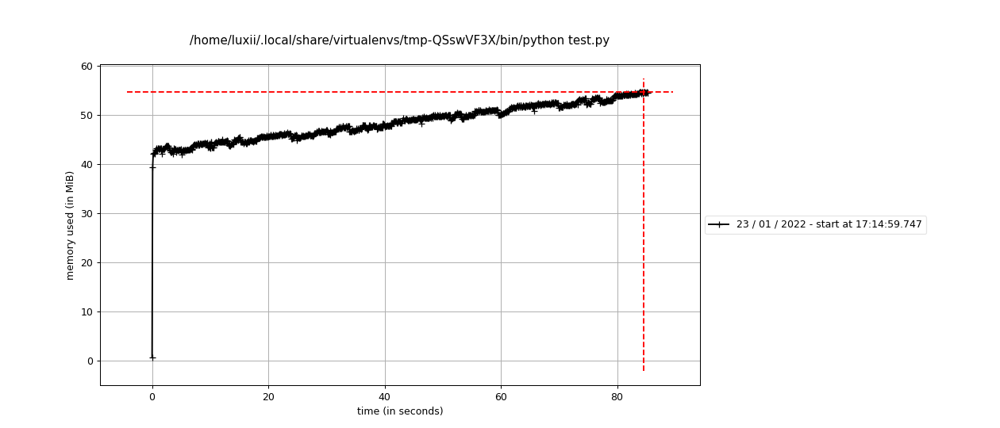
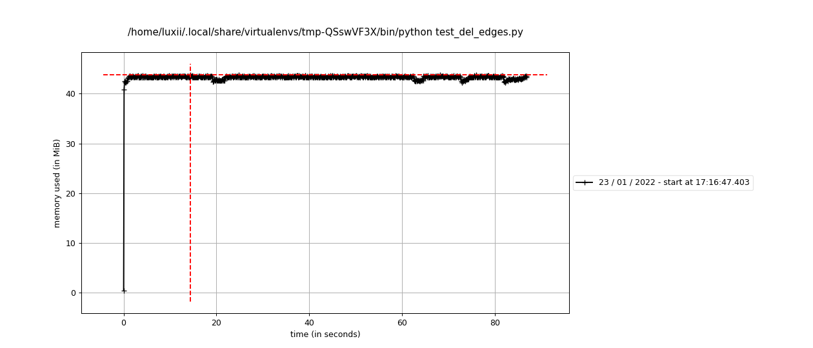
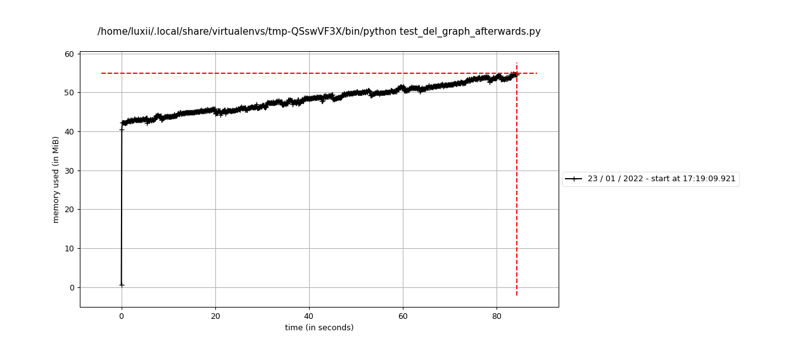

# igraph Memory Leak BUG

This repo is only for demonstrating the memory leak. I was unsure how to share multiple files and figured it would be the most easy to host the scripts in github.

Here are mprofiler images:

test.py memory usage:

test_del_edges.py memory usage:

test_del_graph_afterwards.py memory usage:

